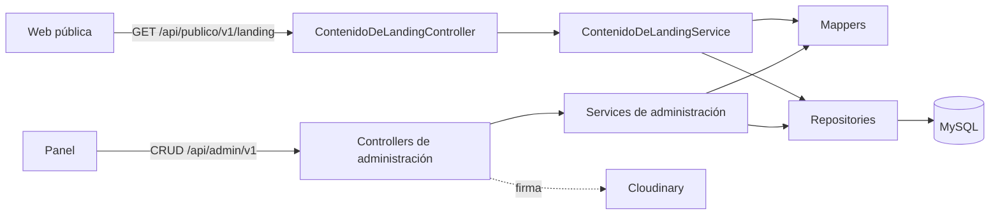
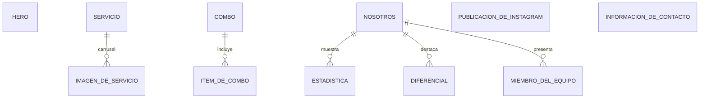

# oriente-api

API de contenido y administración de **Oriente**, un consultorio de kinesiología y
estética personal en Resistencia, Chaco.

La aplicación hace dos cosas: le entrega a la web pública todo el contenido de la
página en una sola lectura, y le da al panel de administración las operaciones
para editarlo.

## Stack

| Pieza | Versión |
|---|---|
| Java | 21 |
| Spring Boot | 4.0.x |
| MySQL | 9 |
| Flyway | gestionado por Spring Boot |
| JWT | jjwt 0.12 |
| Tests | JUnit 5 + MockMvc + Testcontainers |

Sin Lombok y sin MapStruct: las clases llevan sus métodos escritos y los mappers
son interfaz más implementación a mano, porque la traducción entre `domain` y
`dto` tiene decisiones adentro —qué se expone y qué no— que una anotación no
documenta.

## Las dos superficies

La API está partida en dos, y la separación atraviesa todas las capas: rutas,
paquetes, configuración de seguridad y orígenes permitidos.

| | Pública | Administración |
|---|---|---|
| Prefijo | `/api/publico/v1` | `/api/admin/v1` |
| Métodos | sólo `GET` | todos |
| Autenticación | ninguna | JWT en **todas** las operaciones, lecturas incluidas |
| Quién la consume | la web | el panel |
| Qué expone | contenido activo y visible | también lo desactivado y los datos internos |

Cada superficie tiene su propia cadena de filtros, y una tercera cadena rechaza
todo lo que no caiga en las dos anteriores: un endpoint mal ubicado queda cerrado,
no abierto. Las reglas están en `config/` y hay un test por cada una en
`ReglasDeSeguridadTest`.

## Endpoints

### Pública

| Método | Ruta | Devuelve |
|---|---|---|
| `GET` | `/api/publico/v1/landing` | Todo el contenido de la página: hero, servicios con sus imágenes, combos, nosotros, equipo, publicaciones de Instagram y contacto |
| `GET` | `/api/publico/v1/servicios/{slug}` | La ficha de un servicio |

Las dos respuestas salen con `Cache-Control` y `stale-while-revalidate`, para que
el borde las guarde y siga sirviendo la última versión buena si la API no responde.

### Administración

| Método | Ruta | Qué hace |
|---|---|---|
| `POST` | `/api/admin/v1/auth/login` | Devuelve el token |
| `GET` `PUT` | `/api/admin/v1/hero` | Sección única |
| `GET` `PUT` | `/api/admin/v1/nosotros` | Sección única, con estadísticas, diferenciales y equipo anidados |
| `GET` `PUT` | `/api/admin/v1/contacto` | Sección única |
| `GET` `POST` `PUT` `DELETE` | `/api/admin/v1/servicios` | Catálogo, con el carrusel de imágenes anidado |
| `GET` `POST` `PUT` `DELETE` | `/api/admin/v1/combos` | Combos, con sus ítems anidados |
| `GET` `POST` `PUT` `DELETE` | `/api/admin/v1/instagram` | Publicaciones a mostrar |
| `POST` | `/api/admin/v1/imagenes/firma` | Firma un upload a Cloudinary |

Las colecciones que se editan dentro de una sección —imágenes de un servicio,
ítems de un combo, estadísticas, diferenciales, equipo— viajan anidadas y se
guardan con su sección. Es un formulario en el panel y una escritura acá.

## Estructura

```
src/main/java/com/oriente/landing
├── OrienteApplication.java
├── config          Configuración de Spring, filtros, @ConfigurationProperties
├── controller
│   ├── publico         Lo que consume la web
│   └── administracion  Lo que consume el panel
├── domain          Entidades JPA, en singular
├── dto
│   ├── publico         Respuestas de la landing
│   └── administracion  Request y Response por área funcional
├── enumeration     Enums del dominio
├── exception       Excepciones propias y el manejador global
├── mapper + impl   Interfaz y su implementación escrita a mano
├── repository      Interfaces de Spring Data, sin lógica
├── service
│   ├── publico         Armado del contenido de la landing
│   └── administracion  Una carpeta por área, cada una con su impl
└── util            Helpers sin estado

src/main/resources
├── application.yaml
├── application-local.yaml.example
└── db/migration    Migraciones de Flyway

src/test/java/com/oriente/landing   Espeja la estructura, más fixture/
```

### Taxonomía

Los nombres están en español y con preposiciones (`ImagenDeServicio`,
`PropiedadesDeSeguridad`, `ManejadorGlobalDeErrores`); el sufijo técnico queda en
inglés (`Controller`, `Repository`, `Mapper`, `MapperImpl`, `Exception`). Las
entidades de `domain` van en singular, y las tablas y columnas de la base usan los
mismos nombres que el código, en `snake_case`.

Los paquetes de capa están en inglés porque son la convención del framework; el
contexto —público o administración— entra como área dentro de cada capa.

El catálogo de servicios se administra desde `CatalogoDeServiciosService` y no
desde un "ServicioService": la entidad ya se llama `Servicio` y repetir la palabra
no agrega información.

## Arquitectura

Capas: `controller → service → repository → domain`, cada una hablando sólo con la
inmediata inferior. Las entidades nunca salen de la aplicación: los controllers
devuelven DTOs, y el mapeo está escrito en `mapper/impl`.



### Flujo de una lectura de la landing

1. `GET /api/publico/v1/landing` entra por la cadena de seguridad pública, que lo
   deja pasar sin autenticación.
2. `ContenidoDeLandingService` abre una transacción de lectura y arma las seis
   secciones. La transacción envuelve todo el armado porque `open-in-view` está
   apagado: las listas perezosas se resuelven ahí y no más tarde, con la sesión ya
   cerrada.
3. Cada sección puede faltar sin que la respuesta falle: una instalación sin
   contenido cargado devuelve `null` en esa sección en lugar de un error.
4. La respuesta sale con `Cache-Control`.

### Flujo de una escritura

1. El panel manda el token en `Authorization`. `FiltroDeAutenticacionJwt` lo
   traduce en una autenticación de Spring Security, y **no** decide si la ruta
   necesita token: eso es de la cadena de seguridad, así que hay una sola fuente
   de verdad.
2. El service resuelve las reglas del dominio —derivar el slug, verificar que no
   se repita— y delega el mapeo.
3. La sección y sus colecciones anidadas se guardan juntas: la lista que llega
   reemplaza a la guardada, y `orphanRemoval` borra lo que quedó afuera.

### Imágenes

Los archivos no pasan por esta aplicación. El panel pide una firma a
`/api/admin/v1/imagenes/firma` y sube directo a Cloudinary con ella; el
`api_secret` no sale del backend, y la firma sólo autoriza la carpeta configurada.

De cada imagen se guardan tres cosas: la URL que se sirve, el `public_id` de
Cloudinary —sin él no se puede borrar el archivo cuando se borra el registro, y la
cuenta se llena de huérfanos— y el texto alternativo.

Las imágenes del carrusel de un servicio pueden llevar además el link al post de
Instagram del que salieron. Lo que se sirve es siempre la copia en Cloudinary: las
URLs del CDN de Instagram vienen firmadas y expiran.

### Instagram

De cada publicación se guarda su URL, no su contenido: el contenido lo renderiza
el embed oficial de Instagram en el frontend. La URL se normaliza al guardar —se
le recortan los parámetros de seguimiento que Instagram agrega al copiar el link—
para que el mismo post no entre dos veces, y el tipo (post o reel) se deduce del
propio link.

## Base de datos

Flyway es el único dueño del esquema: `ddl-auto` está en `none` y las migraciones
viven en `src/main/resources/db/migration`. Los datos iniciales también son una
migración, idempotente, y no un `CommandLineRunner`.

UTC en los dos lados: el contenedor de la base arranca con
`--default-time-zone=+00:00` y la aplicación guarda con
`hibernate.jdbc.time_zone: UTC`.



## Cómo correr

Requiere Docker y, para el desarrollo diario, Java 21.

```bash
# Todo en contenedores: base de datos y API en http://localhost:8080
docker compose up --build

# Sólo la base, para correr la API desde el IDE con recarga en caliente
docker compose up db
cp src/main/resources/application-local.yaml.example src/main/resources/application-local.yaml
./mvnw spring-boot:run -Dspring-boot.run.profiles=local
```

Las migraciones se aplican al arrancar. Con `docker compose up` completo, la
configuración sale del propio `compose.yaml`; para correr desde el IDE hace falta
`application-local.yaml`, que está ignorado por git.

Una prueba rápida de que quedó andando:

```bash
curl http://localhost:8080/api/publico/v1/landing
```

## Configuración

`application.yaml` no lleva ningún valor concreto de un entorno: todo se lee como
`${VARIABLE:default}`, y el default es el que sirve para desarrollo. Los secretos
no llevan default —con default la aplicación arranca igual con una clave conocida
y nadie se entera—.

| Variable | Obligatoria | Para qué |
|---|---|---|
| `DB_URL` `DB_USERNAME` | no | Conexión a MySQL |
| `DB_PASSWORD` | **sí** | |
| `ADMIN_USERNAME` | no | Usuario del panel |
| `ADMIN_PASSWORD` | **sí** | |
| `JWT_SECRET` | **sí** | Firma de los tokens |
| `JWT_EXPIRATION` | no | Vida del token, en milisegundos |
| `CORS_ORIGENES_PUBLICOS` | no | Orígenes de la web |
| `CORS_ORIGENES_DE_ADMINISTRACION` | no | Orígenes del panel |
| `CLOUDINARY_CLOUD_NAME` `CLOUDINARY_API_KEY` `CLOUDINARY_API_SECRET` `CLOUDINARY_FOLDER` | no | Firma de uploads |

Sin las credenciales de Cloudinary la aplicación arranca normalmente y sólo el
endpoint de firma responde 503 explicando qué falta.

Los headers de seguridad que la aplicación agrega a sus respuestas se configuran
en `config/`.

## Tests

```bash
./mvnw test
```

Los tests de integración levantan un MySQL 9 real con Testcontainers —requiere
Docker corriendo— para que las migraciones se prueben contra el mismo motor que
corre en producción. El resto son unitarios y no necesitan nada.

La estructura de `src/test/java` espeja la de `src/main/java`, más un paquete
`fixture`.

## Despliegue

La aplicación corre en Railway con MySQL gestionado. El `Dockerfile` es
multi-etapa: compila con el JDK y corre sobre el JRE, con un usuario sin
privilegios. Las variables de entorno se configuran en Railway; ninguna vive en
el repositorio.

En una base que ya tiene el esquema creado, Flyway toma la primera migración como
línea de base en lugar de intentar recrear tablas existentes.
